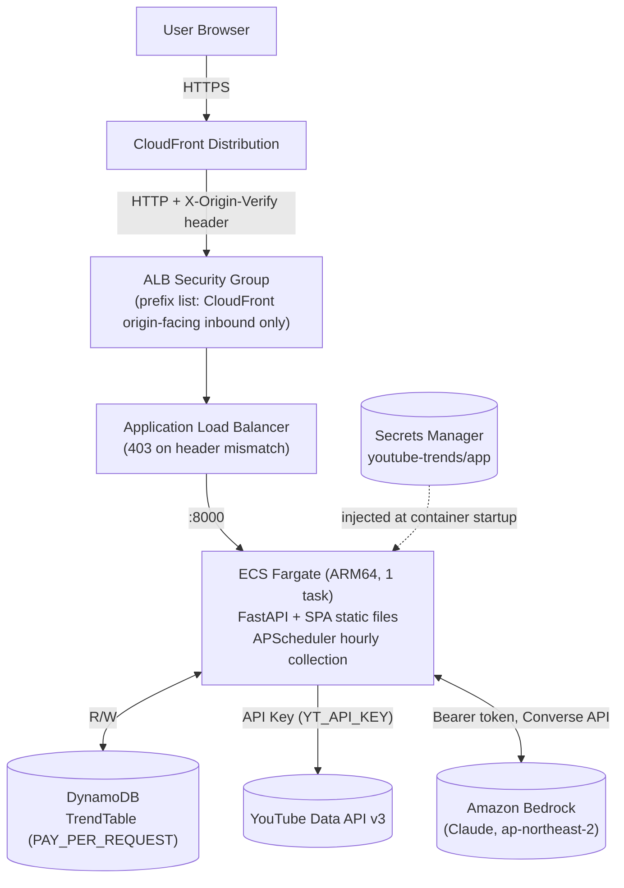

# YouTube Trends

[]()
[]()
[]()
[]()
<a href="#english"></a>
<a href="#korean"></a>

Collect YouTube KR trending data hourly and explore it on the Trend Radar single-page UI — rank movement, AI-tagged card rows, a taste quiz, and LLM briefings with Amazon Bedrock. | YouTube KR 인기 급상승 데이터를 시간 단위로 수집하고, Trend Radar 단일 페이지 UI에서 순위 변동·AI 태깅 카드 행·취향 퀴즈를 탐색하며, Amazon Bedrock으로 LLM 브리핑을 생성합니다.

---

<a id="english"></a>

# English

## Overview

YouTube Trends is a capstone application that collects YouTube KR trending data every hour and presents it on **Trend Radar**, a single-page feed with a hero card, AI-tagged card rows, a taste quiz, 10 color themes, and Bedrock LLM briefings. The backend is FastAPI + DynamoDB, the frontend is a React SPA, and AWS CDK deploys the CloudFront/ALB/Fargate architecture.

## Features

- **Trend Radar home** — A single-page feed (`GET /api/home`, refreshed every 60 seconds): a hero card for the overall #1 video (chart-in tenure, NEW chip), rule-based insight chips (no LLM), and scroll-snap card rows — overall Top-10, fastest rising by views/hour, AI topic rows, age-group rows, and 8 fixed category rows (Music, Gaming, Entertainment, News & Politics, Sports, Film & Animation, Science & Technology, Comedy). Rank delta badges against the previous snapshot and NEW markers for first-time entries are kept on every card.
- **AI tagging rows** — After each hourly collection, a single Bedrock call tags the latest overall snapshot with a fixed vocabulary (topics / age group / vibe). The tags feed the topic and age-group rows and the quiz scoring; if no Bedrock key is set, the home feed still works and tag-based rows are simply omitted.
- **Taste quiz** — Three questions (mood / time / style) are scored deterministically against tags and category weights (`POST /api/quiz`, no LLM call), returning one of 8 fixed types plus a personalized Top-10 row inserted at the top of the home feed.
- **10 color themes** — `[data-theme]` CSS variable sets (default `neon-hunter`), switchable from the top-bar theme modal and persisted in localStorage.
- **Trend time-series charts** — A per-video rank/view chart in the detail modal (log/linear toggle) and a bottom panel charting per-category shares and entered/exited flows over the last 48 hours.
- **LLM brief / trend report** — Generate a current-snapshot summary (`now`) or day-over-day comparison (`daily`) briefing and a 48-hour trend report with Bedrock (Claude, Bearer authentication). Results are cached per hour.

## Architecture



- CloudFront serves the static SPA and `/api/*` from a single distribution, and the ALB front is restricted to inbound traffic from the CloudFront managed prefix list (`origin-facing`) only.
- As a second layer of defense, a fixed header (`X-Origin-Verify`) is verified between CloudFront and the ALB, blocking direct access from other customers' CloudFront distributions that share the same prefix list.
- The ECS task receives its secrets (`YT_API_KEY`, `AWS_BEARER_TOKEN_BEDROCK`) from Secrets Manager only at container startup — the image contains no secret values.
- Bedrock calls use Bearer-token direct REST calls, not SigV4/IAM (see "Notes on the Two Keys" below).

## Prerequisites

- Node.js 22 or later (frontend build; same version as the Docker image build stage)
- Python 3.12 (backend run/test; same version as the Docker runtime stage)
- Docker — `cdk deploy` builds the backend container image locally
- AWS CLI v2 with credentials configured for the target account/region (`ap-northeast-2`)
- A CDK-bootstrapped AWS account (`npx aws-cdk@2 bootstrap`) — run CDK with `npx aws-cdk@2`, not the system-installed `cdk`. The system `cdk` may not match this project's CDK library version.

## Installation

```bash
# Clone the repository
git clone https://github.com/whchoi98/youtube-trends.git
cd youtube-trends

# Prepare secrets
cp .env.example .env
# Open .env and fill in YT_API_KEY (required), AWS_BEARER_TOKEN_BEDROCK (optional), etc.

# Deploy
./scripts/deploy.sh
```

Fill in `ORIGIN_VERIFY_TOKEN` before the first deployment as well. If left empty, a new random value is generated on every CDK synth, CloudFront and the ALB update at different moments on each redeploy, and some users receive 403 during the propagation delay (several minutes). Generate it once with `python3 -c "import secrets; print(secrets.token_urlsafe(24))"` and pin it in `.env` to eliminate this window.

`./scripts/deploy.sh` performs the following in one run:

1. Checks that `.env` exists and is not tracked by git (values are never printed under any circumstances).
2. Pushes the two keys from `.env` to the Secrets Manager secret (`youtube-trends/app`; the name is configurable via `APP_SECRET_NAME`). Creates the secret if missing, updates the value if present.
3. Requires the validation gates to pass before proceeding — backend `pytest -q`, frontend `tsc --noEmit` + `npm run build`.
4. Deploys the stack with `npx aws-cdk@2 deploy YoutubeTrendsStack` (including the backend container image build).
5. Reads `SiteUrl` from the stack outputs and validates the deployment with `./scripts/smoke.sh`.

To rerun only the smoke test:

```bash
./scripts/smoke.sh https://<CloudFront domain>
```

### Live Deployment Record

On 2026-08-04, `YoutubeTrendsStack` was actually deployed and verified in the `ap-northeast-2` region with `./scripts/deploy.sh`.

- **Deployment**: 20 resources, 338 seconds.
- **SiteUrl**: https://d2y73ug3aaah05.cloudfront.net
- **Smoke**: all 6 checks in `./scripts/smoke.sh` (healthz, SPA index, trending, categories, bad scope 400, 404 control) passed (6/6).
- **First snapshot**: hourly collection is aligned to the cron boundary and ran exactly at 14:00 UTC. Verified 30 items for `all` plus 10 items per category stored.
- **LLM**: the first call to Bedrock `global.anthropic.claude-sonnet-4-6` (global inference ID, Bearer authentication) succeeded and generated the briefing and trend report. Calling again within the same hour returned `cached=true`, confirming the once-per-hour token cap works as intended. `daily` mode returned 409 (expected — no baseline) because 24 hours of comparison data had not accumulated yet.
- **Security measurements**: direct access to the ALB DNS name does not even connect (the prefix-list SG blocks access from outside the CloudFront origin-facing ranges). Unregistered `/api/*` paths return 404 (not the SPA fallback — see the "API Documentation" section below).

Note: account-dependent stack outputs such as `AlbDns` and `TableName` differ across accounts and redeployments — the record above is for this single deployment.

## Usage

Run the app locally for development.

Backend (terminal 1):

```bash
cd backend
python3.12 -m venv .venv && .venv/bin/pip install -r requirements-dev.txt
export TABLE_NAME=<local/dev DynamoDB table>
export YT_API_KEY=<key>
export AWS_BEARER_TOKEN_BEDROCK=<optional>
export COLLECT_ENABLED=false   # to keep the hourly collection job off locally
.venv/bin/uvicorn app.main:dev_app --factory --reload --port 8000
```

Frontend (terminal 2):

```bash
cd frontend
npm install
npm run dev
```

`vite.config.ts` proxies `/api` to `http://localhost:8000`, so the frontend dev server (default `http://localhost:5173`) can call the API directly.

## Configuration

All secrets and settings are supplied through a single `.env` file. `deploy.sh` pushes the two keys to Secrets Manager (`youtube-trends/app`).

| Variable | Description | Default |
|----------|-------------|---------|
| `YT_API_KEY` | YouTube Data API v3 key. Required — `deploy.sh` aborts immediately if empty | (none) |
| `AWS_BEARER_TOKEN_BEDROCK` | Bedrock API key (Bearer). Optional — if empty, the LLM endpoints return 503 and AI tagging is skipped | (empty) |
| `ORIGIN_VERIFY_TOKEN` | Fixed CloudFront-to-ALB verification header value. Pinning it is strongly recommended | (regenerated per synth if empty) |
| `VPC_MODE` | `existing` (look up an existing VPC) or `new` (create a new VPC) | `existing` |
| `VPC_NAME` | Name tag of the VPC to look up when `VPC_MODE=existing` | `cc-on-bedrock-vpc` |
| `APP_SECRET_NAME` | Secrets Manager secret name that `deploy.sh` creates/updates | `youtube-trends/app` |

### VPC Modes

Switch with `VPC_MODE` in `.env`.

| Mode | Behavior | Target |
|---|---|---|
| `existing` (default) | Looks up an existing VPC by the `VPC_NAME` tag and reuses it (`ec2.Vpc.from_lookup`). Uses the existing NAT Gateway and subnets as-is | Accounts that already have a reusable VPC (e.g. `cc-on-bedrock-vpc`) — no additional NAT cost |
| `new` | Creates 2 AZs, 2 public + 2 private subnets, 1 NAT Gateway, and a DynamoDB Gateway Endpoint | Accounts using this repo for the first time (no reusable VPC) — incurs new NAT Gateway cost |

### Notes on the Two Keys

#### `YT_API_KEY` (required)

- Create a project in the [Google Cloud Console](https://console.cloud.google.com), enable YouTube Data API v3, and issue an API key.
- A daily quota applies (10,000 units by default). Hourly collection (`mostPopular` + category queries) consumes this quota.
- If the key is missing or empty, `deploy.sh` aborts immediately before the secret push step.

#### `AWS_BEARER_TOKEN_BEDROCK` (optional)

- This app calls Bedrock with a **Bearer token, not SigV4/IAM** (`backend/app/llm/bedrock.py`). The ECS task role is granted no Bedrock-related IAM policy at all.
- **In accounts where an organization SCP denies `InvokeModel` in the Seoul region (`ap-northeast-2`)**, a key issued inside that SCP-bound organization/account cannot bypass it. Bearer authentication does not go through the IAM policy evaluation path, so the SCP cannot block it — but that does not mean Bedrock API key issuance is allowed in the SCP-bound account itself. In practice you must bring a **key issued in a separate account/organization without the SCP restriction**.
- If the key is left empty, deployment proceeds normally: the LLM endpoints (`POST /api/brief`, `POST /api/trends/report`) are disabled with 503 (`enabled: false`) and AI tagging is skipped (the home feed still works — tag-based rows are simply omitted). The remaining features (home feed, Top-10 rows, categories, charts, quiz) are unaffected.

#### Key Rotation Procedure (common)

1. Create a new key at the issuer (Google Cloud Console or the Bedrock API key console). Do not revoke the old key yet.
2. Replace the value in the local `.env` with the new key. `.env` is in `.gitignore` so it never goes into git — double-check that it is not committed.
3. Run `./scripts/deploy.sh` again. The Secrets Manager secret value is updated to the new key (`put-secret-value`).
4. **Caution**: running Fargate tasks read the secret only at container startup, so changing the secret value alone does not propagate to running tasks. If the CDK template itself has no changes, `cdk deploy` may not force a new deployment. To ensure propagation, force a service redeployment:
   ```bash
   CLUSTER=$(aws ecs list-clusters --region ap-northeast-2 \
     --query "clusterArns[?contains(@,'YoutubeTrendsStack')]" --output text)
   SERVICE=$(aws cloudformation describe-stacks --region ap-northeast-2 \
     --stack-name YoutubeTrendsStack \
     --query "Stacks[0].Outputs[?OutputKey=='ServiceName'].OutputValue" --output text)
   aws ecs update-service --region ap-northeast-2 \
     --cluster "$CLUSTER" --service "$SERVICE" --force-new-deployment
   ```
5. Revoke the old key at the issuer only after confirming the new task is healthy.

## Project Structure

```text
youtube-trends/
  backend/           # FastAPI app (collector, store, derive, tagging, llm, api)
    app/             # Application source
    tests/           # pytest suite (92 tests)
    Dockerfile       # Multi-stage image (build context = repo root)
  frontend/          # React 18 + Vite + TypeScript SPA (recharts, react-markdown)
    src/             # Single-page Trend Radar app (App.tsx, components, API client)
  infra/             # AWS CDK (Python) — YoutubeTrendsStack
  scripts/           # deploy.sh, smoke.sh
  docs/              # Documentation
```

## Testing

```bash
# Backend: 92 tests
cd backend && .venv/bin/pytest tests/ -q

# Frontend gate: type check + build
cd frontend && npx tsc --noEmit && npm run build
```

## API Documentation

The base path is `/api`. Every error response has the form `{"error": "<Korean message>"}` with a 4xx/5xx status code. See [docs/api-reference.md](docs/api-reference.md) for the full reference.

| # | Method · Path | Description | Success | Main errors |
|---|---|---|---|---|
| 1 | `GET /api/trending?scope=` | Top-30 list. `scope` is `all` or a category ID (default `all`) | 200 (`[]` if no snapshot) | 400 invalid `scope` |
| 2 | `GET /api/categories` | Fixed list of 8 categories | 200 | — |
| 3 | `GET /api/videos/{video_id}/history?hours=` | Per-video view/rank history. `hours` 1-720 (default 168) | 200 | 400 out-of-range `hours` (FastAPI validation) |
| 4 | `GET /api/trends/categories?hours=` | Per-category share and entered/exited time series. `hours` 2-96 (default 48, safety margin for the DynamoDB 1MB Query limit) | 200 | 400 out-of-range `hours` |
| 5 | `POST /api/brief` `{scope, mode}` | LLM briefing. `mode` is `now`\|`daily` | 200 `{brief, cached}` | 400 invalid `scope`/`mode` · 409 no snapshot/baseline · 502 Bedrock upstream error · 503 key not configured |
| 6 | `POST /api/trends/report` `{scope}` | 48-hour trend report | 200 `{report, cached}` | 400 invalid `scope` · 409 no snapshot · 502 Bedrock upstream error · 503 key not configured |
| 7 | `GET /api/home` | Trend Radar home feed — hero, insight chips, and card rows composed from the latest snapshot (with AI tags when available) | 200 `{capturedAt, tagged, llmEnabled, insights, hero, rows}` | 409 no snapshot |
| 8 | `POST /api/quiz` `{mood, time, style}` | Taste quiz — deterministic scoring, no LLM call | 200 `{type, items}` | 400 invalid body · 409 no snapshot |

In addition, there are `GET /healthz` (ALB health check only; always 200 "ok" without touching external dependencies) and SPA static file serving (`GET /*`) for every request that matches none of the paths above.

### Status Code Contract

| Code | Meaning | Where |
|---|---|---|
| 200 | Success | All endpoints |
| 400 | Bad request (invalid `scope`/`mode`/body, query parameter validation failure) | 1, 3, 4, 5, 6, 8 |
| 409 | No data to show yet (no latest snapshot, no baseline for `daily` comparison) | 5, 6, 7, 8 |
| 502 | Bedrock response error (abnormal status code, parse failure) | 5, 6 |
| 503 | LLM feature disabled (`AWS_BEARER_TOKEN_BEDROCK` not set) | 5, 6 |

## Cost Overview

- **ECS Fargate**: `desired_count=1` (ARM64, 0.5 vCPU / 1GB) always on — the fixed cost without scale-out is the largest item.
- **NAT Gateway**: with `VPC_MODE=existing`, the existing VPC's NAT is reused at no extra cost. `VPC_MODE=new` creates one NAT Gateway, adding hourly plus data processing charges.
- **DynamoDB**: PAY_PER_REQUEST (on-demand) — proportional to traffic; TTL automatically cleans up old items.
- **CloudFront / ALB**: pay-as-you-go by request and data transfer volume. The ALB carries a small always-on cost.
- **Secrets Manager**: a small fixed monthly cost per secret plus API call cost.
- **YouTube Data API / Bedrock**: both usage-based; YouTube can run within the free quota. Bedrock bills per token only when a briefing is requested (no re-invocation on cache hits).

## Contributing

1. Fork the repository
2. Create your branch (`git checkout -b feat/amazing-feature`)
3. Commit changes (`git commit -m 'feat: add amazing feature'`)
4. Push to the branch (`git push origin feat/amazing-feature`)
5. Open a Pull Request

Commit messages follow [Conventional Commits](https://www.conventionalcommits.org/) (`feat:`, `fix:`, `docs:`, `test:`, `chore:`, ...).

## License

No license has been declared for this project. Until a license is added, all rights are reserved by the author.

## Contact

- Maintainer: [whchoi98](https://github.com/whchoi98)
- Issues: https://github.com/whchoi98/youtube-trends/issues
- Email: whchoi98@gmail.com

---

<a id="korean"></a>

# 한국어

## 개요

YouTube Trends는 YouTube KR 인기 급상승 데이터를 시간 단위로 수집해 **Trend Radar** 단일 페이지 피드 — 히어로 카드, AI 태깅 카드 행, 취향 퀴즈, 10종 컬러 테마, Bedrock LLM 브리핑 — 로 보여주는 캡스톤 애플리케이션입니다. 백엔드는 FastAPI + DynamoDB, 프론트엔드는 React SPA이며, AWS CDK로 CloudFront/ALB/Fargate 구성을 배포합니다.

## 주요 기능

- **Trend Radar 홈** — 단일 페이지 피드(`GET /api/home`, 60초 주기 갱신)입니다. 전체 1위 영상의 히어로 카드(차트인 시간·NEW 칩), 규칙 기반 인사이트 칩(LLM 미사용), 스크롤 스냅 카드 행 — 전체 Top-10, 시간당 조회수 급상승, AI 주제 행, 연령대 행, 8개 고정 카테고리(음악/게임/엔터테인먼트/뉴스·정치/스포츠/영화·애니메이션/과학기술/코미디) 행 — 으로 구성됩니다. 직전 스냅샷 대비 순위 변동(델타 배지)과 신규 진입(NEW) 표시는 모든 카드에 유지됩니다.
- **AI 태깅 행** — 매시 수집 후 Bedrock 1회 호출로 최신 전체 스냅샷에 고정 어휘(topics/age/vibe) 태그를 붙입니다. 태그는 주제·연령대 행과 퀴즈 채점에 쓰이며, Bedrock 키가 없어도 홈 피드는 정상 동작하고 태그 기반 행만 생략됩니다.
- **취향 퀴즈** — 3문항(기분/시간대/스타일)을 태그와 카테고리 가중치로 결정적으로 채점해(`POST /api/quiz`, LLM 미호출) 8가지 고정 유형 중 하나와 맞춤 Top-10 행을 반환하고, 홈 피드 상단에 행으로 삽입합니다.
- **컬러 테마 10종** — `[data-theme]` CSS 변수 세트(기본 `neon-hunter`)를 톱바의 테마 모달에서 전환하며 localStorage에 저장됩니다.
- **트렌드 시계열 차트** — 상세 모달의 영상별 순위·조회수 차트(로그/선형 토글)와, 최근 48시간 카테고리별 점유율(shares)·진입/이탈(entered/exited) 추이 하단 패널을 제공합니다.
- **LLM 브리프 / 트렌드 리포트** — Bedrock(Claude, Bearer 인증)으로 현재 스냅샷 요약(`now`) 또는 전일 대비 비교(`daily`) 브리핑과 48시간 트렌드 리포트를 생성합니다. 결과는 시간 단위로 캐시됩니다.

## 아키텍처


- CloudFront가 정적 SPA와 `/api/*`를 같은 배포에서 서빙하며, ALB 앞단은 CloudFront의 관리형 prefix list(`origin-facing`)로만 인바운드를 허용합니다.
- 2차 방어로 CloudFront → ALB 사이에 고정 헤더(`X-Origin-Verify`)를 검사해, prefix list를 공유하는 타 고객의 CloudFront 배포로부터의 직접 접근을 차단합니다.
- ECS 태스크는 시크릿(`YT_API_KEY`, `AWS_BEARER_TOKEN_BEDROCK`)을 Secrets Manager에서 컨테이너 기동 시점에만 주입받습니다 — 이미지에는 값이 없습니다.
- Bedrock 호출은 SigV4/IAM이 아니라 Bearer 토큰 기반 REST 직접 호출입니다(아래 "두 키에 대한 주의" 참고).

## 사전 요구 사항

- Node.js 22 이상 (프론트엔드 빌드, Docker 이미지 빌드 스테이지와 동일 버전)
- Python 3.12 (백엔드 실행/테스트, Docker 런타임 스테이지와 동일 버전)
- Docker — `cdk deploy`가 백엔드 컨테이너 이미지를 로컬에서 빌드합니다
- AWS CLI v2, 대상 계정/리전(`ap-northeast-2`)에 자격 증명 설정 완료
- CDK 부트스트랩이 완료된 AWS 계정 (`npx aws-cdk@2 bootstrap`) — 시스템에 설치된 `cdk`가 아니라 `npx aws-cdk@2`로 실행합니다. 시스템 `cdk`는 이 프로젝트의 CDK 라이브러리 버전과 맞지 않을 수 있습니다.

## 설치 방법

```bash
# Clone the repository
git clone https://github.com/whchoi98/youtube-trends.git
cd youtube-trends

# Prepare secrets
cp .env.example .env
# Open .env and fill in YT_API_KEY (required), AWS_BEARER_TOKEN_BEDROCK (optional), etc.

# Deploy
./scripts/deploy.sh
```

`ORIGIN_VERIFY_TOKEN`도 최초 배포 전에 채워두는 것을 권장합니다. 비워두면 CDK synth마다 새 값이 무작위로 생성되어 재배포할 때마다 CloudFront와 ALB가 서로 다른 시점에 갱신되며, 그 전파 지연(수 분) 동안 일부 사용자가 403을 받습니다. `python3 -c "import secrets; print(secrets.token_urlsafe(24))"`로 한 번만 생성해 `.env`에 고정해두면 이 창이 사라집니다.

`./scripts/deploy.sh`는 아래를 한 번에 수행합니다.

1. `.env` 존재 여부와 git 추적 여부를 검사합니다 (값은 어떤 경우에도 출력하지 않습니다).
2. `.env`의 두 키를 Secrets Manager 시크릿(`youtube-trends/app`, 이름은 `APP_SECRET_NAME`으로 변경 가능)에 push합니다. 시크릿이 없으면 생성하고, 있으면 값을 갱신합니다.
3. 검증 게이트를 통과해야 다음 단계로 진행합니다 — 백엔드 `pytest -q`, 프론트엔드 `tsc --noEmit` + `npm run build`.
4. `npx aws-cdk@2 deploy YoutubeTrendsStack`으로 스택을 배포합니다(백엔드 컨테이너 이미지 빌드 포함).
5. 스택 출력에서 `SiteUrl`을 읽어 `./scripts/smoke.sh`로 배포 결과를 검증합니다.

스모크 테스트만 별도로 다시 돌리려면 다음을 실행합니다.

```bash
./scripts/smoke.sh https://<CloudFront domain>
```

### 라이브 배포 기록

2026-08-04, `ap-northeast-2` 리전에 `./scripts/deploy.sh`로 `YoutubeTrendsStack`을 실제로 배포해 검증했습니다.

- **배포**: 리소스 20개, 배포 소요 338초.
- **SiteUrl**: https://d2y73ug3aaah05.cloudfront.net
- **스모크**: `./scripts/smoke.sh`의 6개 검사(healthz, SPA 인덱스, trending, categories, bad scope 400, 404 대조군) 모두 PASS(6/6).
- **첫 스냅샷**: 시간별 수집이 cron 경계와 정렬되어 14:00 UTC 정각에 수집됐습니다. 전체(all) 30건 + 분야별 10건씩 저장을 확인했습니다.
- **LLM**: Bedrock `global.anthropic.claude-sonnet-4-6`(글로벌 inference ID, Bearer 인증)으로 첫 호출이 성공해 브리핑·추이 리포트를 생성했습니다. 같은 시간대에 재호출하면 `cached=true`로 응답해 시간당 1회 토큰 상한이 의도대로 동작함을 확인했습니다. `daily` 모드는 24시간 비교 데이터가 아직 쌓이지 않은 시점이라 409(정상 — 기준선 없음)를 반환했습니다.
- **보안 실측**: ALB DNS 이름으로 직접 접근을 시도하면 연결 자체가 되지 않습니다(prefix list SG가 CloudFront origin-facing 대역 밖의 접근을 막습니다). 미등록 `/api/*` 경로는 404를 반환합니다(SPA 폴백이 아닙니다 — 아래 "API 문서" 절 참고).

주의: `AlbDns`·`TableName` 등 계정에 종속된 스택 출력값은 계정이나 재배포 시점이 다르면 값이 달라집니다 — 위 기록은 이 1회 배포 기준입니다.

## 사용법

로컬에서 개발용으로 앱을 실행합니다.

백엔드(터미널 1):

```bash
cd backend
python3.12 -m venv .venv && .venv/bin/pip install -r requirements-dev.txt
export TABLE_NAME=<local/dev DynamoDB table>
export YT_API_KEY=<key>
export AWS_BEARER_TOKEN_BEDROCK=<optional>
export COLLECT_ENABLED=false   # to keep the hourly collection job off locally
.venv/bin/uvicorn app.main:dev_app --factory --reload --port 8000
```

프론트엔드(터미널 2):

```bash
cd frontend
npm install
npm run dev
```

`vite.config.ts`가 `/api`를 `http://localhost:8000`으로 프록시하므로, 프론트엔드 dev 서버(기본 `http://localhost:5173`)에서 바로 API를 호출할 수 있습니다.

## 환경 설정

모든 시크릿과 설정은 단일 `.env` 파일로 공급합니다. `deploy.sh`가 두 키를 Secrets Manager(`youtube-trends/app`)에 push합니다.

| Variable | Description | Default |
|----------|-------------|---------|
| `YT_API_KEY` | YouTube Data API v3 키. 필수 — 비어 있으면 `deploy.sh`가 즉시 중단됩니다 | (없음) |
| `AWS_BEARER_TOKEN_BEDROCK` | Bedrock API 키(Bearer). 선택 — 비어 있으면 LLM 엔드포인트가 503을 반환하고 AI 태깅을 건너뜁니다 | (빈 값) |
| `ORIGIN_VERIFY_TOKEN` | CloudFront → ALB 검증 헤더 고정 값. 고정해 두는 것을 강력히 권장합니다 | (비어 있으면 synth마다 재생성) |
| `VPC_MODE` | `existing`(기존 VPC 조회) 또는 `new`(신규 VPC 생성) | `existing` |
| `VPC_NAME` | `VPC_MODE=existing`일 때 조회할 VPC의 Name 태그 | `cc-on-bedrock-vpc` |
| `APP_SECRET_NAME` | `deploy.sh`가 생성/갱신하는 Secrets Manager 시크릿 이름 | `youtube-trends/app` |

### VPC 모드

`.env`의 `VPC_MODE`로 전환합니다.

| 모드 | 동작 | 대상 |
|---|---|---|
| `existing` (기본값) | `VPC_NAME` 태그로 기존 VPC를 조회해 재사용합니다(`ec2.Vpc.from_lookup`). 기존 NAT Gateway·서브넷을 그대로 씁니다 | 이미 재사용 가능한 VPC(예: `cc-on-bedrock-vpc`)가 있는 계정 — NAT 비용이 추가되지 않습니다 |
| `new` | 2 AZ, public 서브넷 2개 + private 서브넷 2개, NAT Gateway 1개, DynamoDB Gateway Endpoint를 새로 만듭니다 | 이 레포를 처음 쓰는 계정(재사용할 VPC가 없음) — NAT Gateway 비용이 새로 발생합니다 |

### 두 키에 대한 주의

#### `YT_API_KEY` (필수)

- [Google Cloud Console](https://console.cloud.google.com)에서 프로젝트를 만들고 YouTube Data API v3를 활성화한 뒤 API 키를 발급합니다.
- 일일 쿼터가 있습니다(기본 10,000 units). 시간별 수집(`mostPopular` + 카테고리 조회)이 이 쿼터를 소비합니다.
- 키가 없거나 비어 있으면 `deploy.sh`가 시크릿 push 이전 단계에서 즉시 중단됩니다.

#### `AWS_BEARER_TOKEN_BEDROCK` (선택)

- 이 앱은 Bedrock을 **SigV4/IAM이 아니라 Bearer 토큰**으로 호출합니다(`backend/app/llm/bedrock.py`). ECS 태스크 역할에는 Bedrock 관련 IAM 정책을 전혀 부여하지 않습니다.
- **조직 SCP가 서울 리전(`ap-northeast-2`)의 `InvokeModel`을 거부하는 계정**에서는, 그 SCP가 걸린 조직/계정 안에서 발급한 키로는 우회할 수 없습니다. Bearer 인증은 IAM 정책 평가 경로를 타지 않으므로 SCP도 이를 막지 못하지만, 그렇다고 SCP가 걸린 계정 자체에서 Bedrock API 키 발급이 허용되는 것은 아닙니다 — 실제로는 **SCP 제약이 없는 별도 계정/조직에서 발급한 키**를 가져와 써야 합니다.
- 키를 비워 두면 배포는 정상적으로 진행되고, LLM 관련 엔드포인트(`POST /api/brief`, `POST /api/trends/report`)가 503(`enabled: false`)으로 비활성화되며 AI 태깅도 건너뜁니다(홈 피드는 정상 동작하고 태그 기반 행만 생략됩니다). 나머지 기능(홈 피드, Top-10 행, 카테고리, 차트, 퀴즈)은 영향받지 않습니다.

#### 키 회전 절차 (공통)

1. 발급처(Google Cloud Console 또는 Bedrock API 키 발급 콘솔)에서 새 키를 만듭니다. 기존 키는 아직 폐기하지 않습니다.
2. 로컬 `.env`의 값을 새 키로 교체합니다. `.env`는 `.gitignore`에 있으므로 git에는 절대 올라가지 않습니다 — 커밋 여부를 다시 확인합니다.
3. `./scripts/deploy.sh`를 다시 실행합니다. Secrets Manager의 시크릿 값이 새 키로 갱신됩니다(`put-secret-value`).
4. **주의**: 이미 실행 중인 Fargate 태스크는 시크릿을 컨테이너 기동 시점에만 읽으므로, 시크릿 값만 바꾼다고 실행 중인 태스크에 자동으로 반영되지 않습니다. CDK 템플릿 자체에 변경이 없으면 `cdk deploy`가 새 배포를 강제하지 않을 수 있습니다. 반영을 확인하려면 서비스 재배포를 강제합니다:
   ```bash
   CLUSTER=$(aws ecs list-clusters --region ap-northeast-2 \
     --query "clusterArns[?contains(@,'YoutubeTrendsStack')]" --output text)
   SERVICE=$(aws cloudformation describe-stacks --region ap-northeast-2 \
     --stack-name YoutubeTrendsStack \
     --query "Stacks[0].Outputs[?OutputKey=='ServiceName'].OutputValue" --output text)
   aws ecs update-service --region ap-northeast-2 \
     --cluster "$CLUSTER" --service "$SERVICE" --force-new-deployment
   ```
5. 새 태스크가 정상(healthy)임을 확인한 뒤에만 발급처에서 이전 키를 폐기합니다.

## 프로젝트 구조

```text
youtube-trends/
  backend/           # FastAPI 앱 (collector, store, derive, tagging, llm, api)
    app/             # 애플리케이션 소스
    tests/           # pytest 스위트 (120개 테스트)
    Dockerfile       # 멀티스테이지 이미지 (빌드 컨텍스트 = 저장소 루트)
  frontend/          # React 18 + Vite + TypeScript SPA (recharts, react-markdown)
    src/             # 단일 페이지 Trend Radar 앱 (App.tsx, 컴포넌트, API 클라이언트)
  infra/             # AWS CDK (Python) — YoutubeTrendsStack
  scripts/           # deploy.sh, smoke.sh
  docs/              # 문서
```

## 테스트

```bash
# Backend: 92 tests
cd backend && .venv/bin/pytest tests/ -q

# Frontend gate: type check + build
cd frontend && npx tsc --noEmit && npm run build
```

## API 문서

베이스 경로는 `/api`입니다. 모든 오류 응답은 `{"error": "<한국어 메시지>"}` 형태이며 4xx/5xx 상태 코드를 동반합니다. 전체 레퍼런스는 [docs/api-reference.md](docs/api-reference.md)를 참고합니다.

| # | 메서드 · 경로 | 설명 | 성공 | 주요 오류 |
|---|---|---|---|---|
| 1 | `GET /api/trending?scope=` | Top-30 목록. `scope`는 `all` 또는 카테고리 ID(기본 `all`) | 200 (스냅샷 없으면 `[]`) | 400 유효하지 않은 `scope` |
| 2 | `GET /api/categories` | 고정 8개 카테고리 목록 | 200 | — |
| 3 | `GET /api/videos/{video_id}/history?hours=` | 영상별 조회수·순위 히스토리. `hours` 1~720(기본 168) | 200 | 400 범위 밖 `hours`(FastAPI 검증) |
| 4 | `GET /api/trends/categories?hours=` | 카테고리별 점유율·진입/이탈 시계열. `hours` 2~96(기본 48, DynamoDB 1MB Query 한도 안전 마진) | 200 | 400 범위 밖 `hours` |
| 5 | `POST /api/brief` `{scope, mode}` | LLM 브리핑. `mode`는 `now`\|`daily` | 200 `{brief, cached}` | 400 잘못된 `scope`/`mode` · 409 스냅샷/기준선 없음 · 502 Bedrock 업스트림 오류 · 503 키 미설정 |
| 6 | `POST /api/trends/report` `{scope}` | 48시간 트렌드 리포트 | 200 `{report, cached}` | 400 잘못된 `scope` · 409 스냅샷 없음 · 502 Bedrock 업스트림 오류 · 503 키 미설정 |
| 7 | `GET /api/home` | Trend Radar 홈 피드 — 최신 스냅샷(가능하면 AI 태그 병합)으로 조합한 히어로·인사이트 칩·카드 행 | 200 `{capturedAt, tagged, llmEnabled, insights, hero, rows}` | 409 스냅샷 없음 |
| 8 | `POST /api/quiz` `{mood, time, style}` | 취향 퀴즈 — 결정적 채점, LLM 미호출 | 200 `{type, items}` | 400 잘못된 본문 · 409 스냅샷 없음 |

이 외에 `GET /healthz`(ALB 헬스체크 전용, 외부 의존성 접근 없이 항상 200 "ok")와, 위 경로에 매칭되지 않는 모든 요청에 대한 SPA 정적 파일 서빙(`GET /*`)이 있습니다.

### 상태 코드 계약

| 코드 | 의미 | 발생 위치 |
|---|---|---|
| 200 | 정상 처리 | 모든 엔드포인트 |
| 400 | 잘못된 요청(유효하지 않은 `scope`/`mode`/본문, 쿼리 파라미터 검증 실패) | 1, 3, 4, 5, 6, 8 |
| 409 | 표시할 데이터가 아직 없음(최신 스냅샷 없음, `daily` 비교용 기준선 없음) | 5, 6, 7, 8 |
| 502 | Bedrock 응답 오류(비정상 상태 코드, 파싱 실패) | 5, 6 |
| 503 | LLM 기능 비활성(`AWS_BEARER_TOKEN_BEDROCK` 미설정) | 5, 6 |

## 비용 개요

- **ECS Fargate**: `desired_count=1`(ARM64, 0.5 vCPU / 1GB) 상시 실행 — 스케일 아웃 없이 고정 비용이 가장 큽니다.
- **NAT Gateway**: `VPC_MODE=existing`이면 기존 VPC의 NAT를 재사용해 추가 비용이 없습니다. `VPC_MODE=new`는 NAT Gateway 1개를 새로 만들어 시간당 요금 + 데이터 처리 요금이 추가됩니다.
- **DynamoDB**: PAY_PER_REQUEST(온디맨드) — 트래픽에 비례하며, TTL로 오래된 항목을 자동 정리합니다.
- **CloudFront / ALB**: 요청량·데이터 전송량 기준 종량제. ALB는 상시 기동 비용이 소액 존재합니다.
- **Secrets Manager**: 시크릿 1개 기준 월 소액 고정 비용 + API 호출 비용.
- **YouTube Data API / Bedrock**: 둘 다 사용량 기준이며, YouTube는 무료 쿼터 안에서 운용 가능합니다. Bedrock은 브리핑 요청 시에만 토큰 단위로 과금됩니다(캐시 히트 시 재호출하지 않음).

## 기여 방법

1. Fork the repository
2. Create your branch (`git checkout -b feat/amazing-feature`)
3. Commit changes (`git commit -m 'feat: add amazing feature'`)
4. Push to the branch (`git push origin feat/amazing-feature`)
5. Open a Pull Request

커밋 메시지는 [Conventional Commits](https://www.conventionalcommits.org/) 규약(`feat:`, `fix:`, `docs:`, `test:`, `chore:` 등)을 따릅니다.

## 라이선스

이 프로젝트는 아직 라이선스가 선언되지 않았습니다. 라이선스가 추가되기 전까지 모든 권리는 작성자에게 있습니다.

## 연락처

- Maintainer: [whchoi98](https://github.com/whchoi98)
- Issues: https://github.com/whchoi98/youtube-trends/issues
- Email: whchoi98@gmail.com
