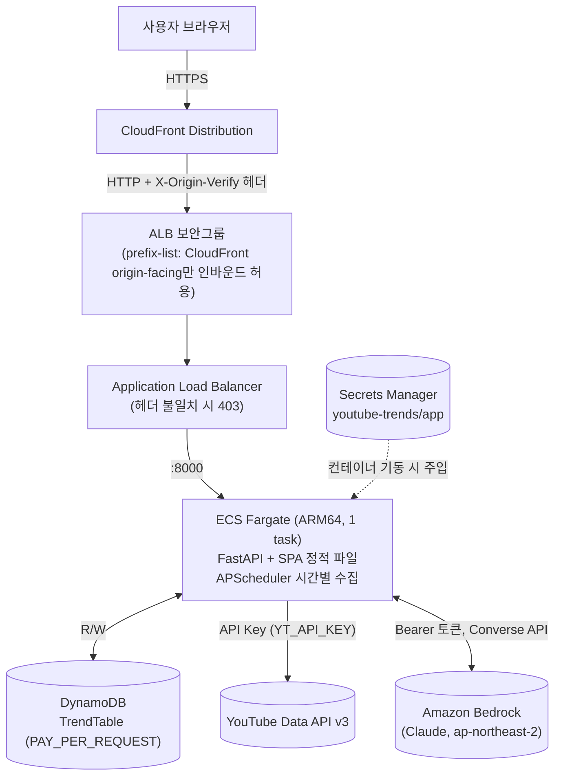

# YouTube Trends

YouTube 인기 급상승 데이터를 시간 단위로 수집하고, 순위 변동과 카테고리별 흐름을 보여주며, Bedrock LLM으로 자연어 브리핑을 생성하는 캡스톤 애플리케이션이다. 백엔드는 FastAPI + DynamoDB, 프론트엔드는 React SPA이며, AWS CDK로 CloudFront/ALB/Fargate 구성을 배포한다.

## 개요

핵심 기능은 4종이다.

1. **Top-30 전체 트렌드** — 전체 인기 급상승 영상 Top-30을 순위·조회수·좋아요와 함께 보여주고, 직전 스냅샷 대비 순위 변동(델타 배지)과 신규 진입(NEW) 여부를 표시한다.
2. **카테고리별 트렌드** — 음악/게임/엔터테인먼트/뉴스·정치/스포츠/영화·애니메이션/과학기술/코미디 8개 고정 카테고리로 필터링해 같은 방식의 순위·변동을 본다.
3. **트렌드 변화 시계열 차트** — 최근 N시간(기본 48h) 동안 카테고리별 점유율(shares)과 진입/이탈(entered/exited) 추이를 차트로 본다.
4. **LLM 브리프 / 트렌드 리포트** — Bedrock(Claude, Bearer 인증)으로 현재 스냅샷 요약(now) 또는 전일 대비 비교(daily) 브리핑과, 48시간 트렌드 리포트를 생성한다. 결과는 시간 단위로 캐시된다.

## 아키텍처



- CloudFront가 정적 SPA와 `/api/*`를 같은 배포에서 서빙하며, ALB 앞단은 CloudFront의 관리형 prefix list(`origin-facing`)로만 인바운드를 허용한다.
- 2차 방어로 CloudFront → ALB 사이에 고정 헤더(`X-Origin-Verify`)를 검사해, prefix list를 공유하는 타 고객의 CloudFront 배포로부터의 직접 접근을 차단한다.
- ECS 태스크는 시크릿(`YT_API_KEY`, `AWS_BEARER_TOKEN_BEDROCK`)을 Secrets Manager에서 컨테이너 기동 시점에만 주입받는다 — 이미지에는 값이 없다.
- Bedrock 호출은 SigV4/IAM이 아니라 Bearer 토큰 기반 REST 직접 호출이다(아래 "두 키에 대한 주의" 참고).

## 사전 요건

- Node.js 22 이상 (프론트엔드 빌드, Docker 이미지 빌드 스테이지와 동일 버전)
- Python 3.12 (백엔드 실행/테스트, Docker 런타임 스테이지와 동일 버전)
- Docker — `cdk deploy`가 백엔드 컨테이너 이미지를 로컬에서 빌드한다
- AWS CLI v2, 대상 계정/리전(`ap-northeast-2`)에 자격 증명 설정 완료
- CDK 부트스트랩이 완료된 AWS 계정 (`npx aws-cdk@2 bootstrap`) — 시스템에 설치된 `cdk`가 아니라 `npx aws-cdk@2`로 실행한다. 시스템 `cdk`는 이 프로젝트의 CDK 라이브러리 버전과 맞지 않을 수 있다.

## 설치 및 배포

```bash
git clone <repo-url>
cd youtube-trends
cp .env.example .env
# .env를 열어 YT_API_KEY(필수), AWS_BEARER_TOKEN_BEDROCK(선택) 등을 채운다
./scripts/deploy.sh
```

`./scripts/deploy.sh`는 아래를 한 번에 수행한다.

1. `.env` 존재 여부와 git 추적 여부를 검사한다 (값은 어떤 경우에도 출력하지 않는다).
2. `.env`의 두 키를 Secrets Manager 시크릿(`youtube-trends/app`, 이름은 `APP_SECRET_NAME`으로 변경 가능)에 push한다. 시크릿이 없으면 생성하고, 있으면 값을 갱신한다.
3. 검증 게이트를 통과해야 다음 단계로 진행한다 — 백엔드 `pytest -q`, 프론트엔드 `tsc --noEmit` + `npm run build`.
4. `npx aws-cdk@2 deploy YoutubeTrendsStack`으로 스택을 배포한다(백엔드 컨테이너 이미지 빌드 포함).
5. 스택 출력에서 `SiteUrl`을 읽어 `./scripts/smoke.sh`로 배포 결과를 검증한다.

스모크 테스트만 별도로 다시 돌리려면:

```bash
./scripts/smoke.sh https://<CloudFront 도메인>
```

### 라이브 배포 기록

2026-08-04, `ap-northeast-2` 리전에 `./scripts/deploy.sh`로 `YoutubeTrendsStack`을 실제로 배포해 검증했다.

- **배포**: 리소스 20개, 배포 소요 338초.
- **SiteUrl**: https://d2y73ug3aaah05.cloudfront.net
- **스모크**: `./scripts/smoke.sh`의 6개 검사(healthz, SPA 인덱스, trending, categories, bad scope 400, 404 대조군) 모두 PASS(6/6).
- **첫 스냅샷**: 시간별 수집이 cron 경계와 정렬되어 14:00 UTC 정각에 수집됐다. 전체(all) 30건 + 분야별 10건씩 저장을 확인했다.
- **LLM**: Bedrock `global.anthropic.claude-sonnet-4-6`(글로벌 inference ID, Bearer 인증)으로 첫 호출이 성공해 브리핑·추이 리포트를 생성했다. 같은 시간대에 재호출하면 `cached=true`로 응답해 시간당 1회 토큰 상한이 의도대로 동작함을 확인했다. `daily` 모드는 24시간 비교 데이터가 아직 쌓이지 않은 시점이라 409(정상 — 기준선 없음)를 반환했다.
- **보안 실측**: ALB DNS 이름으로 직접 접근을 시도하면 연결 자체가 되지 않는다(prefix list SG가 CloudFront origin-facing 대역 밖의 접근을 막는다). 미등록 `/api/*` 경로는 404를 반환한다(SPA 폴백이 아니다 — 위 "API 문서" 절 참고).

주의: `AlbDns`·`TableName` 등 계정에 종속된 스택 출력값은 계정이나 재배포 시점이 다르면 값이 달라진다 — 위 기록은 이 1회 배포 기준이다.

## VPC 모드

`.env`의 `VPC_MODE`로 전환한다.

| 모드 | 동작 | 대상 |
|---|---|---|
| `existing` (기본값) | `VPC_NAME` 태그로 기존 VPC를 조회해 재사용한다(`ec2.Vpc.from_lookup`). 기존 NAT Gateway·서브넷을 그대로 쓴다 | 이미 재사용 가능한 VPC(예: `cc-on-bedrock-vpc`)가 있는 계정 — NAT 비용이 추가되지 않는다 |
| `new` | 2 AZ, public 서브넷 2개 + private 서브넷 2개, NAT Gateway 1개, DynamoDB Gateway Endpoint를 새로 만든다 | 이 레포를 처음 쓰는 계정(재사용할 VPC가 없음) — NAT Gateway 비용이 새로 발생한다 |

## 두 키에 대한 주의

### `YT_API_KEY` (필수)

- [Google Cloud Console](https://console.cloud.google.com)에서 프로젝트를 만들고 YouTube Data API v3를 활성화한 뒤 API 키를 발급한다.
- 일일 쿼터가 있다(기본 10,000 units). 시간별 수집(`mostPopular` + 카테고리 조회)이 이 쿼터를 소비한다.
- 키가 없거나 비어 있으면 `deploy.sh`가 시크릿 push 이전 단계에서 즉시 중단된다.

### `AWS_BEARER_TOKEN_BEDROCK` (선택)

- 이 앱은 Bedrock을 **SigV4/IAM이 아니라 Bearer 토큰**으로 호출한다(`backend/app/llm/bedrock.py`). ECS 태스크 역할에는 Bedrock 관련 IAM 정책을 전혀 부여하지 않는다.
- **조직 SCP가 서울 리전(`ap-northeast-2`)의 `InvokeModel`을 거부하는 계정**에서는, 그 SCP가 걸린 조직/계정 안에서 발급한 키로는 우회할 수 없다. Bearer 인증은 IAM 정책 평가 경로를 타지 않으므로 SCP도 이를 막지 못하지만, 그렇다고 SCP가 걸린 계정 자체에서 Bedrock API 키 발급이 허용되는 것은 아니다 — 실제로는 **SCP 제약이 없는 별도 계정/조직에서 발급한 키**를 가져와 써야 한다.
- 키를 비워 두면 배포는 정상적으로 진행되고, LLM 관련 엔드포인트(`POST /api/brief`, `POST /api/trends/report`)만 503(`enabled: false`)으로 비활성화된다. 나머지 기능(Top-30, 카테고리, 차트)은 영향받지 않는다.

### 키 회전 절차 (공통)

1. 발급처(Google Cloud Console 또는 Bedrock API 키 발급 콘솔)에서 새 키를 만든다. 기존 키는 아직 폐기하지 않는다.
2. 로컬 `.env`의 값을 새 키로 교체한다. `.env`는 `.gitignore`에 있으므로 git에는 절대 올라가지 않는다 — 커밋 여부를 다시 확인한다.
3. `./scripts/deploy.sh`를 다시 실행한다. Secrets Manager의 시크릿 값이 새 키로 갱신된다(`put-secret-value`).
4. **주의**: 이미 실행 중인 Fargate 태스크는 시크릿을 컨테이너 기동 시점에만 읽으므로, 시크릿 값만 바꾼다고 실행 중인 태스크에 자동으로 반영되지 않는다. CDK 템플릿 자체에 변경이 없으면 `cdk deploy`가 새 배포를 강제하지 않을 수 있다. 반영을 확인하려면 서비스 재배포를 강제한다:
   ```bash
   CLUSTER=$(aws ecs list-clusters --region ap-northeast-2 \
     --query "clusterArns[?contains(@,'YoutubeTrendsStack')]" --output text)
   SERVICE=$(aws cloudformation describe-stacks --region ap-northeast-2 \
     --stack-name YoutubeTrendsStack \
     --query "Stacks[0].Outputs[?OutputKey=='ServiceName'].OutputValue" --output text)
   aws ecs update-service --region ap-northeast-2 \
     --cluster "$CLUSTER" --service "$SERVICE" --force-new-deployment
   ```
5. 새 태스크가 정상(healthy)임을 확인한 뒤에만 발급처에서 이전 키를 폐기한다.

## API 문서

베이스 경로는 `/api`이다. 모든 오류 응답은 `{"error": "<한국어 메시지>"}` 형태이며 4xx/5xx 상태 코드를 동반한다.

| # | 메서드 · 경로 | 설명 | 성공 | 주요 오류 |
|---|---|---|---|---|
| 1 | `GET /api/trending?scope=` | Top-30 목록. `scope`는 `all` 또는 카테고리 ID(기본 `all`) | 200 (스냅샷 없으면 `[]`) | 400 유효하지 않은 `scope` |
| 2 | `GET /api/categories` | 고정 8개 카테고리 목록 | 200 | — |
| 3 | `GET /api/videos/{video_id}/history?hours=` | 영상별 조회수·순위 히스토리. `hours` 1~720(기본 168) | 200 | 400 범위 밖 `hours`(FastAPI 검증) |
| 4 | `GET /api/trends/categories?hours=` | 카테고리별 점유율·진입/이탈 시계열. `hours` 2~720(기본 48) | 200 | 400 범위 밖 `hours` |
| 5 | `POST /api/brief` `{scope, mode}` | LLM 브리핑. `mode`는 `now`\|`daily` | 200 `{brief, cached}` | 400 잘못된 `scope`/`mode` · 409 스냅샷/기준선 없음 · 502 Bedrock 업스트림 오류 · 503 키 미설정 |
| 6 | `POST /api/trends/report` `{scope}` | 48시간 트렌드 리포트 | 200 `{report, cached}` | 400 잘못된 `scope` · 409 스냅샷 없음 · 502 Bedrock 업스트림 오류 · 503 키 미설정 |

이 외에 `GET /healthz`(ALB 헬스체크 전용, 외부 의존성 접근 없이 항상 200 "ok")와, 위 경로에 매칭되지 않는 모든 요청에 대한 SPA 정적 파일 서빙(`GET /*`)이 있다.

### 상태 코드 계약

| 코드 | 의미 | 발생 위치 |
|---|---|---|
| 200 | 정상 처리 | 모든 엔드포인트 |
| 400 | 잘못된 요청(유효하지 않은 `scope`/`mode`, 쿼리 파라미터 검증 실패) | 1, 3, 4, 5, 6 |
| 409 | 표시할 데이터가 아직 없음(최신 스냅샷 없음, `daily` 비교용 기준선 없음) | 5, 6 |
| 502 | Bedrock 응답 오류(비정상 상태 코드, 파싱 실패) | 5, 6 |
| 503 | LLM 기능 비활성(`AWS_BEARER_TOKEN_BEDROCK` 미설정) | 5, 6 |

## 로컬 개발

백엔드(터미널 1):

```bash
cd backend
python3.12 -m venv .venv && .venv/bin/pip install -r requirements-dev.txt
export TABLE_NAME=<로컬/개발용 DynamoDB 테이블>
export YT_API_KEY=<키>
export AWS_BEARER_TOKEN_BEDROCK=<선택>
export COLLECT_ENABLED=false   # 로컬에서 시간별 수집 작업을 켜지 않으려면
.venv/bin/uvicorn app.main:dev_app --factory --reload --port 8000
```

프론트엔드(터미널 2):

```bash
cd frontend
npm install
npm run dev
```

`vite.config.ts`가 `/api`를 `http://localhost:8000`으로 프록시하므로, 프론트엔드 dev 서버(기본 `http://localhost:5173`)에서 바로 API를 호출할 수 있다.

테스트만 돌리려면:

```bash
cd backend && .venv/bin/pytest -q     # 65개 테스트
cd frontend && npx tsc --noEmit && npm run build
```

## 비용 개요

- **ECS Fargate**: `desired_count=1`(ARM64, 0.5 vCPU / 1GB) 상시 실행 — 스케일 아웃 없이 고정 비용이 가장 크다.
- **NAT Gateway**: `VPC_MODE=existing`이면 기존 VPC의 NAT를 재사용해 추가 비용이 없다. `VPC_MODE=new`는 NAT Gateway 1개를 새로 만들어 시간당 요금 + 데이터 처리 요금이 추가된다.
- **DynamoDB**: PAY_PER_REQUEST(온디맨드) — 트래픽에 비례하며, TTL로 오래된 항목을 자동 정리한다.
- **CloudFront / ALB**: 요청량·데이터 전송량 기준 종량제. ALB는 상시 기동 비용이 소액 존재한다.
- **Secrets Manager**: 시크릿 1개 기준 월 소액 고정 비용 + API 호출 비용.
- **YouTube Data API / Bedrock**: 둘 다 사용량 기준이며, YouTube는 무료 쿼터 안에서 운용 가능하다. Bedrock은 브리핑 요청 시에만 토큰 단위로 과금된다(캐시 히트 시 재호출하지 않음).
