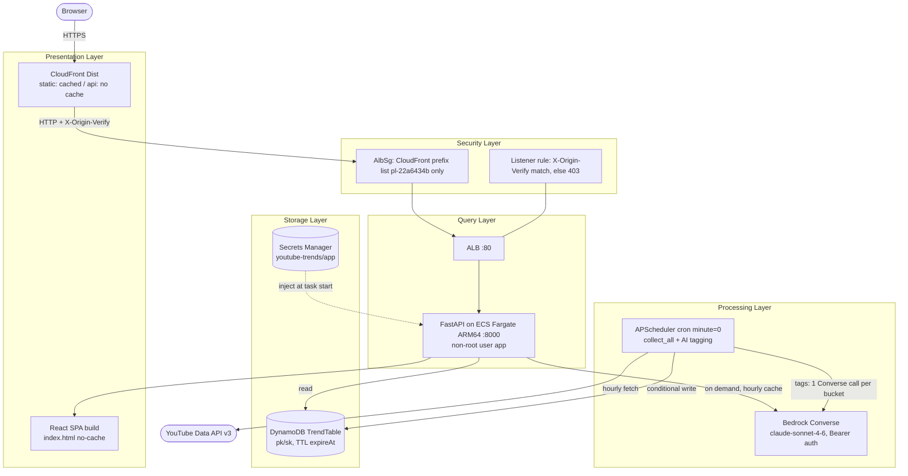
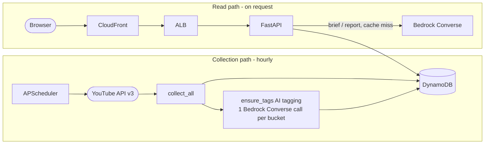

# Architecture

---

# English

## System Overview

YouTube Trends is a single-container full-stack service. One ECS Fargate (ARM64) task runs a FastAPI application that serves both the built React SPA — Trend Radar, a single-page redesign that replaced the previous 3-tab UI, installable as a home-screen PWA (manifest plus a conservative service worker; `sw.js`/`manifest.webmanifest` are served `no-cache` like `index.html` so CloudFront's 24h cache cannot delay updates) — and the `/api` endpoints, and hosts an in-process APScheduler that collects YouTube rankings every hour into a single DynamoDB table: the KR most-popular chart (Top 30 overall + Top 20 for 8 fixed categories), Top 20 country charts for US/JP/GB/IN, five official YouTube Music charts (each snapshot write followed by per-song time-series points for month-long history), three channel spotlights (AWS Korea/Anthropic/OpenAI), and a trending-channel ranking derived from the overall list. Each hourly collection is followed by an AI tagging step: one Bedrock Converse call per hour bucket assigns topic/age/vibe tags to the overall snapshot (idempotent — a no-op if tags already exist, skipped entirely when no Bedrock token is set). The SPA is driven by a single composition endpoint, `GET /api/home` (hero + row strips + null-safe insights), plus a deterministic taste quiz, `POST /api/quiz` (no LLM call). CloudFront fronts an internet-facing ALB; the ALB accepts traffic only from CloudFront (managed prefix list + `X-Origin-Verify` header). LLM briefings and trend reports are generated on demand through the Bedrock Converse REST API (`global.anthropic.claude-sonnet-4-6`, Seoul endpoint, Bearer auth) and cached per hour bucket in the same table.

The primary flows are: hourly collection (scheduler → YouTube Data API v3 → DynamoDB, conditional write, then the AI tagging step → Bedrock Converse → DynamoDB) and read (browser → CloudFront → ALB → FastAPI → DynamoDB — the home screen through the `/api/home` composition endpoint — plus Bedrock for LLM endpoints).

## Components

### Presentation Layer
- **CloudFront Distribution (`Dist`)** -- Serves the whole site over HTTPS. Default behavior uses `CACHING_OPTIMIZED` for hashed static assets; the `/api/*` behavior uses `CACHING_DISABLED` with `ALL_VIEWER_EXCEPT_HOST_HEADER` and allows all methods.
- **React SPA (`frontend/`)** -- React 18 + Vite + TypeScript. Trend Radar single page: top bar + hero + insight chips + scroll-snap row strips + bottom panels (category-share trends, AI brief) + modals (quiz, theme, video detail), polling `GET /api/home` every 60 seconds with a generation-token race guard; 10 selectable `[data-theme]` CSS-variable themes. recharts for time-series charts, react-markdown for LLM report rendering. Built in the first Docker stage and served by FastAPI from `/srv/static`; `index.html` is returned with `Cache-Control: no-cache`.

### Query Layer
- **ALB (`Alb`)** -- Internet-facing; default listener action is a fixed `403`. A priority-1 rule forwards only requests carrying the correct `X-Origin-Verify` header to the target group (container port 8000, health check `/healthz`).
- **FastAPI app (`backend/app/`)** -- Routers `trending`, `videos`, `trends`, `brief`, `home` (the `home` router serves the `GET /api/home` composition endpoint and the deterministic `POST /api/quiz`). Every error follows the contract `{"error": <Korean message>}` with a 4xx/5xx status (FastAPI's default 422 detail array is overridden to 400). A catch-all route serves the SPA and returns `404` for unregistered `/api/*` paths.

### Processing Layer
- **APScheduler collector (`backend/app/collector/`)** -- `BackgroundScheduler` cron at minute 0 (UTC) runs `collect_all`: overall Top 30 first (cycle aborts if it fails), then 8 category Top 20s with per-category fallback — an unsupported/failed category is derived from the overall list and marked `degraded` — followed by Top 20 country charts (US/JP/GB/IN, a failed country is skipped alone), five official YouTube Music charts (`app/charts.py` `MUSIC_CHARTS`, scope `chart-{suffix}` — playlist order is the chart rank, each chart fails in isolation; each chart snapshot write is followed by a per-song point batch (`CVID#`, `put_chart_points`) for long-range history), the channel spotlights (`app/spotlights.py` `SPOTLIGHTS` — aws/anthropic/openai, scope `spot-{suffix}`, uploads-playlist path ranked by views, per-channel isolation), and the trending-channel ranking (`chan-top` — `channels_stats` over the overall list's channel ids, ranked by summed trending views). Snapshots are written with `attribute_not_exists(pk)` so concurrent tasks cannot double-write. Each hourly cycle then runs the AI tagging step (`backend/app/tagging.py`, `ensure_tags`): one Bedrock Converse call per hour bucket assigns topic/age/vibe tags to the overall snapshot — idempotent (no-op when tags already exist), skipped entirely when no Bedrock token is set, and retried next cycle on failure (nothing is stored). The same tagging also runs once right after startup.
- **Bedrock LLM (`backend/app/llm/`)** -- Direct Converse REST call to `global.anthropic.claude-sonnet-4-6` on the `ap-northeast-2` endpoint with `Authorization: Bearer` (no SigV4/boto3). A missing token raises `LlmDisabled` → `503`; upstream failures map to `502` with the upstream status attached.

### Storage Layer
- **DynamoDB (`TrendTable`)** -- Single table, `pk`/`sk` string keys, `PAY_PER_REQUEST`. Key families: `SNAP#ALL` / `SNAP#CAT#{id}` (scope snapshots), `VID#{videoId}` (per-video time series), `REPORT#{kind}#{scope}` (LLM cache), `TAGS#ALL` (hourly AI tags). Sort key `TS#YYYY-MM-DDTHH` (UTC hour bucket). TTL attribute `expireAt`: 30 days for snapshots and video points, 2 days for reports and tags.
- **Secrets Manager (`youtube-trends/app`)** -- `scripts/deploy.sh` pushes `YT_API_KEY` and `AWS_BEARER_TOKEN_BEDROCK` before `cdk deploy`; the stack references the secret by name only, and ECS injects values at container start. Secret values never appear in the template or image.

### Security Layer
- **ALB security group (`AlbSg`)** -- Inbound port 80 allowed only from the CloudFront origin-facing managed prefix list `pl-22a6434b` (ap-northeast-2).
- **`X-Origin-Verify` header** -- CloudFront attaches a fixed custom header; the ALB forwards only on an exact match and otherwise returns `403`. This blocks other customers' CloudFront distributions, which share the same prefix list.
- **Non-root container** -- The runtime image creates user `app` and drops root before starting uvicorn.

## Full Architecture Diagram

## Data Flow Summary

## Infrastructure

### Deployment Region
- `ap-northeast-2` (Seoul). VPC has two modes: `existing` (lookup by `Name` tag, default `cc-on-bedrock-vpc`) and `new` (2 AZ + 1 NAT + DynamoDB gateway endpoint).

### CDK Constructs (`infra/stacks/service.py`, stack `YoutubeTrendsStack`)

| Construct | Resources | Description |
|-----------|-----------|-------------|
| `TrendTable` | DynamoDB table | `pk`/`sk`, `PAY_PER_REQUEST`, TTL `expireAt`, `RemovalPolicy.DESTROY` (capstone-scale cleanup) |
| `Cluster` / `Task` / `Service` | ECS Fargate | ARM64, 512 CPU / 1024 MiB, desired 1, deployment circuit breaker with rollback, image built from `backend/Dockerfile` with repo root as build context |
| `Alb` + `Http` listener | ALB, listener, target group | Default fixed `403`; priority-1 rule on `X-Origin-Verify` → port 8000, health check `/healthz`, deregistration delay 30s |
| `AlbSg` | Security group | Inbound 80 from CloudFront origin-facing prefix list only |
| `Dist` | CloudFront distribution | Default behavior cached; `/api/*` caching disabled, all methods, custom header `X-Origin-Verify` to origin |
| `AppSecret` | Secrets Manager reference | `from_secret_name_v2` — values pushed by `scripts/deploy.sh`, never in the template |

### Deployed Resources
- SiteUrl: `https://d2y73ug3aaah05.cloudfront.net` (deployed 2026-08-04; account-bound — changes on redeploy)
- Stack outputs: `SiteUrl`, `AlbDns`, `TableName`, `ServiceName`

## Key Design Decisions

- **DynamoDB, not S3, for time series** -- Baseline lookups fall back through hour offsets (1→2→3→4h, 24→25→26h) as individual computed-key `GetItem`s; a key-value store answers these in single-digit ms without scans or Athena, and the `expireAt` TTL expires 30-day-old data with zero operational work.
- **In-container scheduler + conditional write** -- APScheduler inside the API container avoids a separate Lambda/EventBridge deployment surface. Rolling deploys (100%/200%) briefly run two tasks; `attribute_not_exists(pk)` makes duplicate collection a silently-skipped no-op instead of corrupted double-writes.
- **Bearer auth for Bedrock** -- The organization SCP denies SigV4 `InvokeModel` in the Seoul region, so the app calls the Converse REST endpoint directly with a Bearer API key issued outside the org. The task role intentionally has no Bedrock IAM policy.
- **Hourly LLM cache** -- Source data changes only once per hour, so briefs/reports are cached per hour bucket in DynamoDB (TTL 2 days). This bounds Bedrock cost and latency: at most one generation per (kind, scope, hour).
- **`index.html` no-cache** -- Hashed assets are immutable and safely cached by CloudFront, but a stale `index.html` after redeploy would reference deleted hashed assets and break the site; forcing revalidation on `index.html` alone keeps caching benefits without that failure mode.
- **`/healthz` touches no dependencies** -- The ALB health check verifies process liveness only, so a DynamoDB outage degrades responses instead of triggering a task-replacement storm.

## Operations

- Deployment: `./scripts/deploy.sh` (secret push → tests → frontend gate → `npx aws-cdk@2 deploy` → smoke). See runbooks in [docs/runbooks/](runbooks/).
- Smoke test: `./scripts/smoke.sh <SiteUrl>`
- Incident response and other procedures: see [docs/runbooks/](runbooks/) (create from [docs/runbooks/.template.md](runbooks/.template.md)).
- Architectural decisions: record in [docs/decisions/](decisions/) using [docs/decisions/.template.md](decisions/.template.md).

---

# 한국어

## 시스템 개요

YouTube Trends는 단일 컨테이너 풀스택 서비스다. ECS Fargate(ARM64) 태스크 하나가 FastAPI 애플리케이션을 실행하며, 이 앱이 빌드된 React SPA — 기존 3탭 UI를 대체한 단일 페이지 개편판 Trend Radar로, 홈 화면 설치형 PWA다(매니페스트 + 보수적 서비스 워커. `sw.js`/`manifest.webmanifest`는 `index.html`과 같은 근거로 no-cache 서빙해 CloudFront 24h 캐시로 인한 업데이트 지연을 막는다) — 와 `/api` 엔드포인트를 함께 서빙하고, 프로세스 내 APScheduler가 매시 정각 YouTube 랭킹을 수집해 단일 DynamoDB 테이블에 저장한다: KR 인기 급상승 차트(전체 Top 30 + 고정 8개 카테고리 Top 20), 미/일/영/인 국가별 Top 20, YouTube Music 공식 차트 5종(스냅샷 저장 시 곡별 시계열 포인트를 함께 적재해 한 달 추이 지원), 채널 스포트라이트 3종(AWS Korea/Anthropic/OpenAI), 전체 목록에서 파생한 급상승 채널 랭킹. 매시 수집 뒤에는 AI 태깅 단계가 이어진다: 시간 버킷당 Bedrock Converse 1콜로 전체 스냅샷에 주제/연령/무드 태그를 부여한다(멱등 — 태그가 이미 있으면 no-op, Bedrock 토큰 미설정 시 전체 생략). SPA는 단일 조합 엔드포인트 `GET /api/home`(히어로 + 행 스트립 + null 안전 인사이트)과 결정적 취향 퀴즈 `POST /api/quiz`(LLM 미호출)로 구동된다. CloudFront가 인터넷 페이싱 ALB 앞에 서고, ALB는 CloudFront에서 온 트래픽만 허용한다(관리형 prefix list + `X-Origin-Verify` 헤더). LLM 브리핑과 추이 리포트는 Bedrock Converse REST API(`global.anthropic.claude-sonnet-4-6`, 서울 엔드포인트, Bearer 인증)로 요청 시 생성되며 같은 테이블에 시간 버킷 단위로 캐시된다.

주 흐름은 두 가지다. 시간별 수집(스케줄러 → YouTube Data API v3 → DynamoDB 조건부 쓰기, 이어서 AI 태깅 단계 → Bedrock Converse → DynamoDB)과 조회(브라우저 → CloudFront → ALB → FastAPI → DynamoDB — 홈 화면은 `/api/home` 조합 엔드포인트를 거친다 — LLM 엔드포인트는 추가로 Bedrock 호출)다.

## 구성 요소

### Presentation 레이어
- **CloudFront Distribution(`Dist`)** -- 사이트 전체를 HTTPS로 서빙한다. 기본 동작은 해시 자산용 `CACHING_OPTIMIZED`, `/api/*` 동작은 `CACHING_DISABLED` + `ALL_VIEWER_EXCEPT_HOST_HEADER`이며 모든 메서드를 허용한다.
- **React SPA(`frontend/`)** -- React 18 + Vite + TypeScript. Trend Radar 단일 페이지: 톱바 + 히어로 + 인사이트 칩 + 스크롤 스냅 행 스트립 + 하단 패널(카테고리 점유율 추이, AI 브리핑) + 모달(퀴즈·테마·영상 상세) 구성이며, `GET /api/home`을 60초 간격으로 폴링하고 세대 토큰 레이스 가드를 적용한다. `[data-theme]` CSS 변수 테마 10종을 선택할 수 있다. 시계열 차트는 recharts, LLM 리포트 렌더는 react-markdown을 쓴다. Docker 첫 번째 스테이지에서 빌드되어 FastAPI가 `/srv/static`에서 서빙하고, `index.html`은 `Cache-Control: no-cache`로 반환된다.

### Query 레이어
- **ALB(`Alb`)** -- 인터넷 페이싱이며 리스너 기본 동작은 고정 `403`이다. priority 1 규칙이 올바른 `X-Origin-Verify` 헤더를 가진 요청만 타깃 그룹(컨테이너 포트 8000, 헬스체크 `/healthz`)으로 전달한다.
- **FastAPI 앱(`backend/app/`)** -- `trending`, `videos`, `trends`, `brief`, `home` 라우터로 구성된다(`home` 라우터가 조합 엔드포인트 `GET /api/home`과 결정적 `POST /api/quiz`를 서빙한다). 모든 오류는 `{"error": 한국어 메시지}` + 4xx/5xx 계약을 따른다(FastAPI 기본 422 detail 배열은 400으로 대체). catch-all 라우트가 SPA를 서빙하고 미등록 `/api/*` 경로에는 `404`를 반환한다.

### Processing 레이어
- **APScheduler 수집기(`backend/app/collector/`)** -- `BackgroundScheduler`가 UTC 매시 정각에 `collect_all`을 실행한다. 전체 Top 30을 먼저 수집하고(실패 시 사이클 전체 중단), 8개 카테고리 Top 20은 카테고리 단위로 폴백한다 — 미지원/실패 카테고리는 전체 목록에서 파생하고 `degraded`로 표시한다. 이어서 국가별 Top 20(미/일/영/인 — 실패한 국가만 건너뜀), YouTube Music 공식 차트 5종(`app/charts.py` `MUSIC_CHARTS`, 스코프 `chart-{suffix}` — 재생목록 순서가 곧 차트 순위, 차트별 실패 격리. 차트 스냅샷 저장 직후 곡별 포인트(`CVID#`, `put_chart_points`)를 batch 적재해 장기 추이를 지원한다), 채널 스포트라이트(`app/spotlights.py` `SPOTLIGHTS` — aws/anthropic/openai, 스코프 `spot-{suffix}`, uploads 재생목록 경로의 조회수 랭킹, 채널별 격리), 급상승 채널 랭킹(`chan-top` — 전체 목록의 채널 id로 `channels_stats` 후 합산 급상승 조회수 정렬)을 수집한다. 스냅샷은 `attribute_not_exists(pk)` 조건부 쓰기라 동시 태스크가 이중 기록할 수 없다. 매시 수집 사이클 뒤에는 AI 태깅 단계(`backend/app/tagging.py`, `ensure_tags`)가 이어진다 — 시간 버킷당 Bedrock Converse 1콜로 전체 스냅샷에 주제/연령/무드 태그를 부여하며, 멱등이고(태그가 이미 있으면 no-op) Bedrock 토큰 미설정 시 전체를 건너뛰며 실패 시 저장 없이 다음 사이클에 재시도한다. 기동 직후에도 같은 태깅이 1회 실행된다.
- **Bedrock LLM(`backend/app/llm/`)** -- `ap-northeast-2` 엔드포인트의 `global.anthropic.claude-sonnet-4-6`에 `Authorization: Bearer`로 Converse REST를 직접 호출한다(SigV4/boto3 미사용). 토큰 미설정은 `LlmDisabled` → `503`, 상류 실패는 상류 상태 코드를 담아 `502`로 매핑된다.

### Storage 레이어
- **DynamoDB(`TrendTable`)** -- 단일 테이블, `pk`/`sk` 문자열 키, `PAY_PER_REQUEST`. 키 패밀리는 `SNAP#ALL` / `SNAP#CAT#{id}`(스코프 스냅샷), `VID#{videoId}`(영상 시계열), `REPORT#{kind}#{scope}`(LLM 캐시), `TAGS#ALL`(시간별 AI 태그)다. 정렬 키는 `TS#YYYY-MM-DDTHH`(UTC 시간 버킷)이며, TTL 속성 `expireAt`은 스냅샷·영상 포인트 30일, 리포트·태그 2일이다.
- **Secrets Manager(`youtube-trends/app`)** -- `scripts/deploy.sh`가 `cdk deploy` 전에 `YT_API_KEY`와 `AWS_BEARER_TOKEN_BEDROCK`을 push하고, 스택은 시크릿을 이름으로만 참조하며, ECS가 컨테이너 기동 시 값을 주입한다. 시크릿 값은 템플릿과 이미지에 절대 나타나지 않는다.

### Security 레이어
- **ALB 보안 그룹(`AlbSg`)** -- 인바운드 80 포트를 CloudFront origin-facing 관리형 prefix list `pl-22a6434b`(ap-northeast-2)에만 허용한다.
- **`X-Origin-Verify` 헤더** -- CloudFront가 고정 커스텀 헤더를 부착하고, ALB는 정확히 일치할 때만 전달하며 그 외에는 `403`을 반환한다. 같은 prefix list를 공유하는 타 고객의 CloudFront 배포를 차단하는 2중 방어다.
- **비루트 컨테이너** -- 런타임 이미지가 `app` 사용자를 생성하고 root 권한을 내려놓은 뒤 uvicorn을 시작한다.

## 전체 아키텍처 다이어그램

## 데이터 흐름 요약

## 인프라

### 배포 리전
- `ap-northeast-2`(서울). VPC는 2모드다: `existing`(`Name` 태그 조회, 기본 `cc-on-bedrock-vpc`)과 `new`(2 AZ + NAT 1 + DynamoDB 게이트웨이 엔드포인트).

### CDK Construct (`infra/stacks/service.py`, 스택 `YoutubeTrendsStack`)

| Construct | 리소스 | 설명 |
|-----------|--------|------|
| `TrendTable` | DynamoDB 테이블 | `pk`/`sk`, `PAY_PER_REQUEST`, TTL `expireAt`, `RemovalPolicy.DESTROY`(캡스톤 규모 — 정리 편의 우선) |
| `Cluster` / `Task` / `Service` | ECS Fargate | ARM64, 512 CPU / 1024 MiB, desired 1, 배포 서킷 브레이커 + 롤백, 이미지는 저장소 루트를 컨텍스트로 `backend/Dockerfile`에서 빌드 |
| `Alb` + `Http` 리스너 | ALB, 리스너, 타깃 그룹 | 기본 고정 `403`; priority 1 규칙이 `X-Origin-Verify` 일치 시 8000 포트로 전달, 헬스체크 `/healthz`, 등록 해제 지연 30초 |
| `AlbSg` | 보안 그룹 | 인바운드 80을 CloudFront origin-facing prefix list에만 허용 |
| `Dist` | CloudFront 배포 | 기본 동작 캐시; `/api/*`는 캐시 비활성 + 전체 메서드 허용, 오리진에 `X-Origin-Verify` 커스텀 헤더 부착 |
| `AppSecret` | Secrets Manager 참조 | `from_secret_name_v2` — 값은 `scripts/deploy.sh`가 push하며 템플릿에는 없음 |

### 배포된 리소스
- SiteUrl: `https://d2y73ug3aaah05.cloudfront.net` (2026-08-04 배포, 계정 종속 — 재배포 시 변동)
- 스택 출력: `SiteUrl`, `AlbDns`, `TableName`, `ServiceName`

## 핵심 설계 결정

- **시계열 저장소로 S3가 아닌 DynamoDB 채택** -- 기준 스냅샷 조회는 시간 오프셋(1→2→3→4h, 24→25→26h)을 계산된 키로 개별 `GetItem` 폴백한다. 키-값 저장소는 스캔이나 Athena 없이 한 자릿수 ms로 응답하고, `expireAt` TTL이 30일 지난 데이터를 운영 작업 없이 자동 만료시킨다.
- **컨테이너 내 스케줄러 + 조건부 쓰기** -- API 컨테이너 내부의 APScheduler는 별도 Lambda/EventBridge 배포 표면을 없앤다. 롤링 배포(100%/200%) 중 태스크가 잠시 2개가 되는데, `attribute_not_exists(pk)` 조건부 쓰기가 중복 수집을 손상된 이중 기록이 아니라 조용히 건너뛰는 no-op으로 만든다.
- **Bedrock Bearer 인증** -- 조직 SCP가 서울 리전의 SigV4 `InvokeModel`을 거부하므로, 조직 밖에서 발급한 Bearer API 키로 Converse REST 엔드포인트를 직접 호출한다. 태스크 롤에 Bedrock IAM 정책을 부여하지 않은 것은 의도된 결정이다.
- **시간당 LLM 캐시** -- 원본 데이터가 시간당 한 번만 바뀌므로 브리프/리포트를 DynamoDB에 시간 버킷 단위로 캐시한다(TTL 2일). (kind, scope, hour)당 생성이 최대 1회로 제한되어 Bedrock 비용과 지연이 상한을 갖는다.
- **`index.html` no-cache** -- 해시 자산은 불변이라 CloudFront 캐시가 안전하지만, 재배포 후 낡은 `index.html`이 남으면 사라진 해시 자산을 참조해 사이트가 깨진다. `index.html`만 재검증을 강제해 캐시 이점을 유지하면서 이 실패 모드를 제거한다.
- **`/healthz`는 외부 의존에 접근하지 않음** -- ALB 헬스체크는 프로세스 생존만 확인하므로, DynamoDB 장애 시 응답이 열화될 뿐 태스크 교체 폭풍이 일어나지 않는다.

## 운영

- 배포: `./scripts/deploy.sh` (시크릿 push → 테스트 → 프론트 게이트 → `npx aws-cdk@2 deploy` → 스모크). 런북은 [docs/runbooks/](runbooks/) 참고.
- 스모크 테스트: `./scripts/smoke.sh <SiteUrl>`
- 장애 대응 등 운영 절차: [docs/runbooks/](runbooks/)에서 관리한다([docs/runbooks/.template.md](runbooks/.template.md)로 작성).
- 아키텍처 결정 기록: [docs/decisions/](decisions/)에 [docs/decisions/.template.md](decisions/.template.md)로 기록한다.
